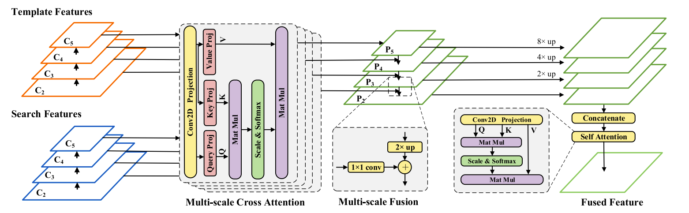

# Exploiting More Information in Sparse Point Cloud for 3D Single Object Tracking
## Overview

- [Introduction](#introduction)
- [Performance](#performance)
- [Setup](#setup)
- [QuickStart](#quickstart)
- [Acknowledgment](#acknowledgment)
- [Citation](#citation)

## Introduction

This is the official code release of **IEEE Robotics and Automation Letters** [Paper](https://ieeexplore.ieee.org/document/9899707) "**Exploiting More Information in Sparse Point Cloud for 3D Single Object Tracking**"

### Abstract
3D single object tracking is a key task in 3D computer vision. However, the sparsity of point clouds makes it difficult to compute the similarity and locate the object, posing big challenges to the 3D tracker. Previous works tried to solve the problem and improved the tracking performance in some common scenarios, but they usually failed in some extreme sparse scenarios, such as for tracking objects at long distances or partially occluded. To address the above problems, in this letter, we propose a sparse-to-dense and transformer-based framework for 3D single object tracking. First, we transform the 3D sparse points into 3D pillars and then compress them into 2D bird’s eye view (BEV) features to have a dense representation. Then,we propose an attention-based encoder to achieve global similarity computation between template and search branches, which could alleviate the influence of sparsity. Meanwhile, the encoder applies the attention on multi-scale features to compensate for the lack of information caused by the sparsity of point cloud and the single scale of features. Finally, we use set-prediction to track the object through a two-stage de- coder which also utilizes attention. Extensive experiments show that our method achieves very promising results on the KITTI and NuScenes datasets.



## Performance

### Kitti Dataset
Pretrained models could be download from [Here](https://drive.google.com/drive/u/0/folders/1iPcxub21IyWcNcv5h7e84sZVQfyoqU_h)

|           | Car  | Ped  | Van  | Cyclist  | Mean  |
| --------- | ---- | ---- | ---- | -------- | ----- |
| Success   | 71.5 | 55.3 | 42.3 | 68.7     | 61.8  |
| Precision | 82.1 | 82.5 | 50.2 | 92.0     | 79.7  |

## Setup

### Installation

   ```bash
   conda create -n smat python=3.8 -y
   conda activate smat
   
   pip install torch==1.8.1+cu111 torchvision==0.9.1+cu111 torchaudio==0.8.1 -f https://download.pytorch.org/whl/torch_stable.html
   
   # please refer to https://github.com/traveller59/spconv
   pip install spconv-cu111

   git clone https://github.com/3bobo/smat
   cd smat/
   pip install -r requirements.txt

   python setup.py develop
   ```

### Dataset preparation

   Download the dataset from [KITTI Tracking](http://www.cvlibs.net/datasets/kitti/eval_tracking.php) and organize the downloaded files as follows:

   ```bash
   lttr                                           
   |-- data                                     
   |   |-- kitti
   │   │    ├── calib
   │   │    ├── label_02
   │   │    └── velodyne
   
   ```

## QuickStart

### Train

For training, you can customize the training by modifying the parameters in the yaml file of the corresponding model, such as '**CLASS_NAMES**'.

After configuring the yaml file, run the following command to parser the path of config file and the training tag.

```bash
cd smat/tools
# python train.py --cfg_file cfgs/kitti_models/kitti_car.yaml --extra_tag car
python train.py --cfg_file $model_config_path
```

For training with ddp, you can execute the following command ( ensure be root dir ):

```bash
cd smat/tools
bash dist_train.sh $NUM_GPUs --cfg_file $model_config_path
```

### Eval

```bash
cd smat/tools
# for single model
python test.py --cfg_file $model_config_path --ckpt $your_saved_ckpt
# for all saved model
python test.py --cfg_file $model_config_path --ckpt $your_saved_ckpt --eval_all
```

For now, the code does not support ddp eval.

## Acknowledgment

- This repo is built upon [LTTR](https://github.com/3bobo/lttr), [P2B](https://github.com/HaozheQi/P2B) and [OpenPCDet](https://github.com/open-mmlab/OpenPCDet).  
- Thank [traveller59](https://github.com/traveller59) for his implementation of [Spconv](https://github.com/traveller59/spconv).
- Thank [fundamentalvision](https://github.com/fundamentalvision) for his implementation of [Deformable-DETR](https://github.com/fundamentalvision/Deformable-DETR).
## Citation

If you find the project useful for your research, you may cite,

```
@ARTICLE{smat,
  author={Cui, Yubo and Shan, Jiayao and Gu, Zuoxu and Li, Zhiheng and Fang, Zheng},
  journal={IEEE Robotics and Automation Letters}, 
  title={Exploiting More Information in Sparse Point Cloud for 3D Single Object Tracking}, 
  year={2022},
  volume={7},
  number={4},
  pages={11926-11933},
  doi={10.1109/LRA.2022.3208687}}
```
